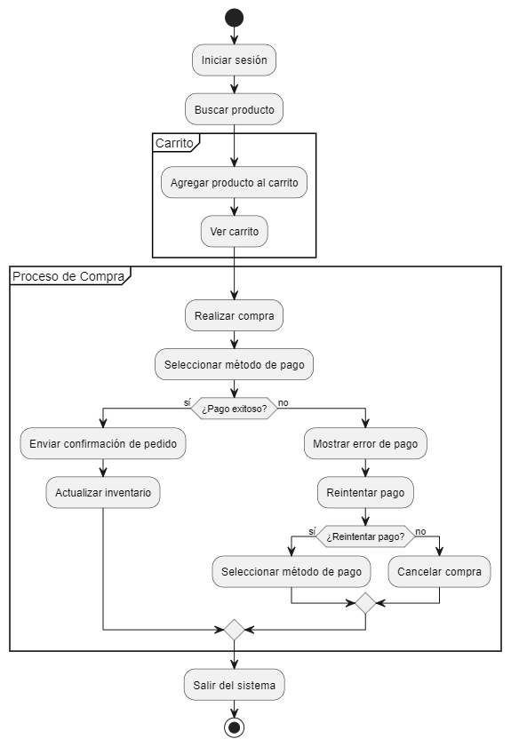

# Diagrama de Actividad del Carrito de Compras

## ¿Qué es un Diagrama de Actividad?

Un **Diagrama de Actividad** es un tipo de diagrama UML que se utiliza para modelar el flujo de trabajo o de procesos dentro de un sistema. Este diagrama se centra en describir las actividades secuenciales y paralelas, mostrando cómo se llevan a cabo las operaciones y decisiones en un flujo de control.

## Elementos del Diagrama de Actividad

- **Actividades**: Representan las acciones o pasos que se realizan en el proceso, como "Iniciar sesión", "Buscar producto", "Agregar producto al carrito", etc.
- **Particiones**: Agrupan actividades relacionadas en secciones que representan diferentes contextos o módulos, como "Carrito" y "Proceso de Compra".
- **Decisiones**: Representadas con rombos, muestran las condiciones que afectan el flujo del proceso, como "¿Pago exitoso?".
- **Flujos**: Indican la secuencia de actividades y decisiones, conectando los diferentes elementos del diagrama.

## Propósito del Diagrama de Actividad

El Diagrama de Actividad es útil para:

1. **Modelar Flujos de Trabajo**: Permite visualizar cómo se desarrollan los procesos dentro de un sistema, identificando pasos secuenciales y posibles ramificaciones.
2. **Identificar Actividades Paralelas**: Muestra cómo diferentes actividades pueden llevarse a cabo simultáneamente en el flujo de trabajo.
3. **Facilitar la Comprensión de Procesos Complejos**: Ayuda a desglosar procesos en componentes más manejables, haciendo que sean más fáciles de entender y analizar.

Este diagrama de actividad proporciona una representación clara del flujo de trabajo en el sistema de carrito de compras, destacando las actividades secuenciales y paralelas que el usuario experimenta al realizar una compra.


## Codigo del diagrama
```planuml
@startuml
|Usuario|
start
:Iniciar sesión;
:Buscar producto;

partition "Carrito" {
    :Agregar producto al carrito;
    :Ver carrito;
}

partition "Proceso de Compra" {
    :Realizar compra;
    :Seleccionar método de pago;

    if (¿Pago exitoso?) then (sí)
        :Enviar confirmación de pedido;
        :Actualizar inventario;
    else (no)
        :Mostrar error de pago;
        :Reintentar pago;
        if (¿Reintentar pago?) then (sí)
            :Seleccionar método de pago;
        else (no)
            :Cancelar compra;
        endif
    endif
}

:Salir del sistema;
stop
@enduml
```

## Resultado
