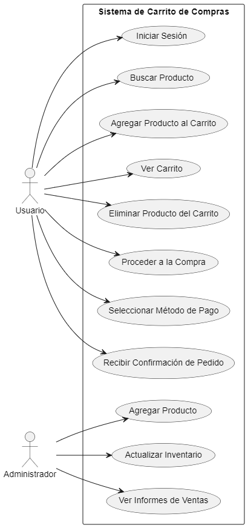

# Diagrama de Casos de Uso del Carrito de Compras

## ¿Qué es un Diagrama de Casos de Uso?

Un **Diagrama de Casos de Uso** es una representación visual de las funcionalidades de un sistema desde la perspectiva del usuario. Este diagrama muestra cómo los actores interactúan con el sistema y cuáles son los casos de uso disponibles, facilitando la comprensión de los requerimientos funcionales.

## Elementos del Diagrama de Casos de Uso

- **Actores**: Representan a los usuarios o sistemas externos que interactúan con el sistema. En este caso, tenemos:
  - **Usuario**: Quien realiza acciones dentro del sistema de carrito de compras.
  - **Administrador**: Quien gestiona productos y el inventario.
  
- **Casos de Uso**: Representan las funcionalidades que el sistema ofrece a los actores. Algunos ejemplos son:
  - **Iniciar Sesión**
  - **Buscar Producto**
  - **Agregar Producto al Carrito**
  - **Ver Carrito**
  - **Proceder a la Compra**
  - **Recibir Confirmación de Pedido**

## Propósito del Diagrama de Casos de Uso

El Diagrama de Casos de Uso es útil para:

1. **Definir Requerimientos Funcionales**: Ayuda a identificar qué funcionalidades necesita el sistema y cómo interactuarán los actores con él.
2. **Facilitar la Comunicación**: Proporciona un lenguaje visual común que puede ser entendido por diferentes interesados, como desarrolladores, diseñadores y usuarios finales.
3. **Guía para el Desarrollo**: Sirve como base para el desarrollo del sistema, asegurando que todas las funcionalidades requeridas sean consideradas e implementadas.

Este diagrama de casos de uso ofrece una visión clara de las funcionalidades disponibles en el sistema de carrito de compras y cómo los usuarios y administradores interactúan con él.


## Codigo del diagrama
```planuml
@startuml
left to right direction

actor Usuario
actor Administrador

rectangle "Sistema de Carrito de Compras" {
    Usuario --> (Iniciar Sesión)
    Usuario --> (Buscar Producto)
    Usuario --> (Agregar Producto al Carrito)
    Usuario --> (Ver Carrito)
    Usuario --> (Eliminar Producto del Carrito)
    Usuario --> (Proceder a la Compra)
    Usuario --> (Seleccionar Método de Pago)
    Usuario --> (Recibir Confirmación de Pedido)

    Administrador --> (Agregar Producto)
    Administrador --> (Actualizar Inventario)
    Administrador --> (Ver Informes de Ventas)
}

@enduml
```

## Resultado
