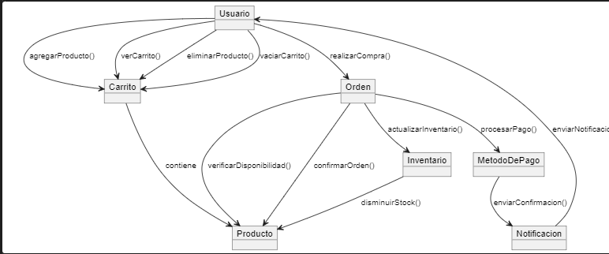

# Diagrama de Colaboración del Carrito de Compras

## ¿Qué es un Diagrama de Colaboración?

Un **Diagrama de Colaboración** es un diagrama UML que ilustra cómo los objetos interactúan entre sí, destacando las relaciones y mensajes intercambiados. Este tipo de diagrama es útil para entender la estructura del sistema y cómo los diferentes componentes colaboran para llevar a cabo funcionalidades específicas.

## Elementos del Diagrama de Colaboración

- **Objetos**:
  - **Usuario**: Interactúa con el sistema, gestionando su carrito y realizando compras.
  - **Carrito**: Contiene los productos seleccionados por el usuario.
  - **Producto**: Representa los artículos disponibles para la compra.
  - **Orden**: Representa la transacción de compra realizada por el usuario.
  - **MetodoDePago**: Maneja los métodos de pago seleccionados para la compra.
  - **Inventario**: Controla la disponibilidad de los productos.
  - **Notificacion**: Envía confirmaciones y notificaciones al usuario.

## Propósito del Diagrama de Colaboración

El Diagrama de Colaboración es útil para:

1. **Visualizar las Relaciones entre Objetos**: Se pueden identificar las conexiones y dependencias entre los diferentes componentes del sistema.
2. **Describir Interacciones en un Contexto de Objetos**: Permite observar las acciones que cada objeto lleva a cabo en el proceso de compra.
3. **Facilitar el Diseño Orientado a Objetos**: Ayuda a estructurar y organizar la arquitectura del sistema, resaltando cómo los objetos colaboran para cumplir con las funcionalidades requeridas.

Este diagrama de colaboración ofrece una visión integral de cómo los distintos objetos interactúan en el sistema de carrito de compras, haciendo hincapié en las relaciones y mensajes entre ellos.

## Codigo del diagrama
```planuml
@startuml
object Usuario
object Carrito
object Producto
object Orden
object MetodoDePago
object Inventario
object Notificacion

' Relación entre Usuario y Carrito
Usuario --> Carrito : "agregarProducto()"
Usuario --> Carrito : "verCarrito()"
Usuario --> Carrito : "eliminarProducto()"
Usuario --> Carrito : "vaciarCarrito()"

' Relación entre Carrito y Producto
Carrito --> Producto : "contiene"

' Relación entre Usuario y Orden
Usuario --> Orden : "realizarCompra()"

' Relación entre Orden y Producto
Orden --> Producto : "verificarDisponibilidad()"
Orden --> Producto : "confirmarOrden()"

' Relación entre Orden y MetodoDePago
Orden --> MetodoDePago : "procesarPago()"

' Relación entre MetodoDePago y Notificacion
MetodoDePago --> Notificacion : "enviarConfirmacion()"

' Relación entre Orden y Inventario
Orden --> Inventario : "actualizarInventario()"
Inventario --> Producto : "disminuirStock()"

' Relación entre Notificacion y Usuario
Notificacion --> Usuario : "enviarNotificacion()"
@enduml
```

## Resultado
