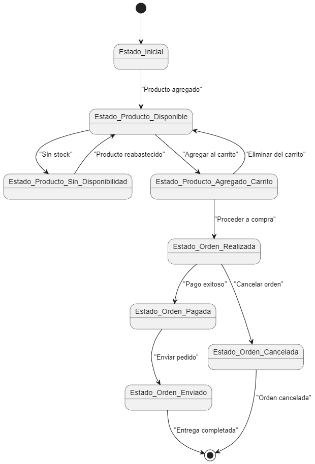

# Diagrama de Estados del Carrito de Compras

## ¿Qué es un Diagrama de Estados?

Un **Diagrama de Estados** es un tipo de diagrama UML que representa los estados de un objeto y las transiciones entre estos estados en respuesta a eventos o condiciones. Este tipo de diagrama es útil para comprender cómo cambia el estado de un objeto a lo largo del tiempo en un sistema.

## Elementos del Diagrama de Estados

- **Estados**: Representan las diferentes condiciones o situaciones en las que puede encontrarse un objeto, como "Producto disponible", "Producto sin disponibilidad", "Producto agregado al carrito", "Orden realizada", entre otros.
- **Transiciones**: Indican el cambio de un estado a otro, generalmente en respuesta a un evento o acción, como "Producto agregado", "Proceder a compra", "Pago exitoso", etc.
- **Eventos**: Son las acciones o condiciones que provocan las transiciones entre estados.

## Propósito del Diagrama de Estados

El Diagrama de Estados es útil para:

1. **Visualizar el Ciclo de Vida de un Objeto**: Permite observar cómo un objeto cambia de estado a lo largo de su existencia dentro del sistema.
2. **Identificar Eventos Clave**: Muestra las acciones que provocan cambios de estado, lo que es crucial para entender el comportamiento del sistema.
3. **Facilitar el Diseño de Sistemas**: Ayuda a los desarrolladores a planificar la lógica del sistema, asegurando que todos los posibles estados y transiciones estén considerados.

Este diagrama de estados ilustra claramente los estados del objeto "Producto" y el objeto "Orden" en el sistema de carrito de compras, así como las transiciones que ocurren en respuesta a eventos específicos.


## Codigo del diagrama
```planuml
@startuml
[*] --> Estado_Inicial

Estado_Inicial --> Estado_Producto_Disponible : "Producto agregado"
Estado_Producto_Disponible --> Estado_Producto_Sin_Disponibilidad : "Sin stock"
Estado_Producto_Sin_Disponibilidad --> Estado_Producto_Disponible : "Producto reabastecido"

Estado_Producto_Disponible --> Estado_Producto_Agregado_Carrito : "Agregar al carrito"
Estado_Producto_Agregado_Carrito --> Estado_Producto_Disponible : "Eliminar del carrito"
Estado_Producto_Agregado_Carrito --> Estado_Orden_Realizada : "Proceder a compra"

Estado_Orden_Realizada --> Estado_Orden_Pagada : "Pago exitoso"
Estado_Orden_Pagada --> Estado_Orden_Enviado : "Enviar pedido"
Estado_Orden_Enviado --> [*] : "Entrega completada"

Estado_Orden_Realizada --> Estado_Orden_Cancelada : "Cancelar orden"
Estado_Orden_Cancelada --> [*] : "Orden cancelada"
@enduml
```

## Resultado
