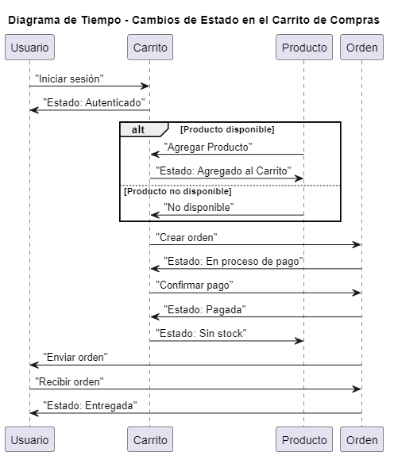

# Diagrama de Tiempo del Carrito de Compras

## ¿Qué es un Diagrama de Tiempo?

Un **Diagrama de Tiempo** es un tipo de diagrama UML que representa el cambio de estado de los objetos o eventos a lo largo del tiempo. Este diagrama es útil para visualizar cómo los estados de las instancias en un sistema evolucionan y se ven afectados mutuamente.

## Elementos del Diagrama de Tiempo

- **Objetos**: Entidades en el sistema cuyos estados cambian con el tiempo. En este caso, tenemos:
  - **Usuario**: Representa al cliente que interactúa con el sistema.
  - **Carrito**: Representa el carrito de compras que contiene los productos seleccionados por el usuario.
  - **Producto**: Representa los artículos que están disponibles para la compra.
  - **Orden**: Representa el estado de la compra una vez que el usuario ha realizado su selección.

- **Estados**: Indican las diferentes condiciones que puede tener cada objeto en momentos específicos:
  - "No autenticado": El usuario no ha iniciado sesión.
  - "Autenticado": El usuario ha iniciado sesión con éxito.
  - "Vacío": El carrito no contiene productos.
  - "Contiene 0 productos": El carrito está preparado pero no tiene productos añadidos.
  - "Contiene 1 producto": El carrito tiene un producto añadido.
  - "Agregado al Carrito": Indica que un producto ha sido añadido.
  - "Creada": Indica que la orden de compra ha sido creada.
  - "En proceso de pago": Indica que la orden está en la fase de pago.
  - "Pagada": La orden ha sido pagada con éxito.
  - "Sin stock": El producto ya no está disponible.
  - "Enviada": La orden ha sido enviada al usuario.
  - "Entregada": La orden ha sido entregada al usuario.

## Propósito del Diagrama de Tiempo

El Diagrama de Tiempo es útil para:

1. **Visualizar Cambios de Estado**: Permite observar cómo los estados de los objetos cambian a lo largo del tiempo, proporcionando una comprensión clara de la dinámica del sistema.
2. **Identificar Eventos y Transiciones**: Muestra cómo los eventos (como agregar un producto al carrito o realizar un pago) afectan a los diferentes objetos y sus estados.
3. **Facilitar el Análisis de Procesos**: Ayuda a identificar problemas potenciales en el flujo del sistema y optimizar los procesos involucrados.

Este diagrama de tiempo ilustra claramente cómo los estados del usuario, carrito, producto y orden cambian a lo largo de una secuencia temporal en el sistema de carrito de compras.


## Codigo del diagrama
```planuml
@startuml
title Diagrama de Tiempo - Cambios de Estado en el Carrito de Compras

participant Usuario
participant Carrito
participant Producto
participant Orden

Usuario -> Carrito: "Iniciar sesión"
Carrito -> Usuario: "Estado: Autenticado"

alt Producto disponible
    Producto -> Carrito: "Agregar Producto"
    Carrito -> Producto: "Estado: Agregado al Carrito"
else Producto no disponible
    Producto -> Carrito: "No disponible"
end

Carrito -> Orden: "Crear orden"
Orden -> Carrito: "Estado: En proceso de pago"

Carrito -> Orden: "Confirmar pago"
Orden -> Carrito: "Estado: Pagada"
Carrito -> Producto: "Estado: Sin stock"

Orden -> Usuario: "Enviar orden"
Usuario -> Orden: "Recibir orden"
Orden -> Usuario: "Estado: Entregada"

@enduml
```

## Resultado
