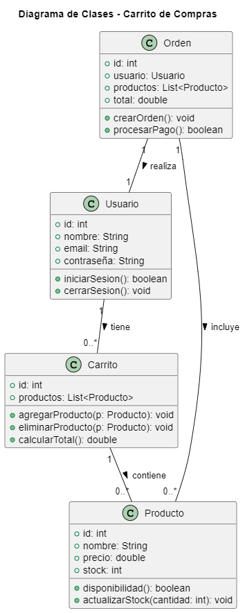

# Diagrama de Clases del Carrito de Compras

## ¿Qué es un Diagrama de Clases?

Un **Diagrama de Clases** es un tipo de diagrama UML que muestra las clases en un sistema, sus atributos, métodos y las relaciones entre ellas. Este diagrama es fundamental para entender la estructura estática de un sistema orientado a objetos.

## Elementos del Diagrama de Clases

- **Clases**: Representan entidades en el sistema. En este caso, tenemos:
  - **Usuario**: Representa a un cliente que interactúa con el sistema.
    - **Atributos**:
      - `id`: Identificador único del usuario.
      - `nombre`: Nombre del usuario.
      - `email`: Correo electrónico del usuario.
      - `contraseña`: Contraseña del usuario.
    - **Métodos**:
      - `iniciarSesion()`: Permite al usuario iniciar sesión.
      - `cerrarSesion()`: Permite al usuario cerrar sesión.

  - **Producto**: Representa los artículos disponibles para la compra.
    - **Atributos**:
      - `id`: Identificador único del producto.
      - `nombre`: Nombre del producto.
      - `precio`: Precio del producto.
      - `stock`: Cantidad disponible en stock.
    - **Métodos**:
      - `disponibilidad()`: Verifica si el producto está disponible.
      - `actualizarStock(cantidad: int)`: Actualiza el stock del producto.

  - **Carrito**: Representa el carrito de compras que contiene productos seleccionados.
    - **Atributos**:
      - `id`: Identificador único del carrito.
      - `productos`: Lista de productos en el carrito.
    - **Métodos**:
      - `agregarProducto(p: Producto)`: Agrega un producto al carrito.
      - `eliminarProducto(p: Producto)`: Elimina un producto del carrito.
      - `calcularTotal()`: Calcula el total de la compra.

  - **Orden**: Representa una orden de compra realizada por un usuario.
    - **Atributos**:
      - `id`: Identificador único de la orden.
      - `usuario`: Usuario que realiza la orden.
      - `productos`: Lista de productos en la orden.
      - `total`: Total de la orden.
    - **Métodos**:
      - `crearOrden()`: Crea una nueva orden.
      - `procesarPago()`: Procesa el pago de la orden.

## Relaciones entre Clases

- **Usuario** tiene uno o más **Carritos**.
- **Carrito** contiene uno o más **Productos**.
- **Orden** es realizada por un único **Usuario**.
- **Orden** incluye uno o más **Productos**.

## Propósito del Diagrama de Clases

El Diagrama de Clases es útil para:

1. **Visualizar la Estructura del Sistema**: Muestra cómo están organizadas las clases y sus relaciones, lo que es esencial para el diseño de sistemas orientados a objetos.
2. **Facilitar la Comprensión de la Lógica del Sistema**: Permite a los desarrolladores y diseñadores entender cómo interactúan las distintas partes del sistema.
3. **Servir como Base para la Implementación**: Proporciona un plano que puede ser utilizado para implementar el sistema en código.

Este diagrama de clases proporciona una visión clara de las entidades que componen un sistema de carrito de compras y cómo se relacionan entre sí.

## Codigo del diagrama
```planuml
@startuml
title Diagrama de Clases - Carrito de Compras

class Usuario {
    +id: int
    +nombre: String
    +email: String
    +contraseña: String
    +iniciarSesion(): boolean
    +cerrarSesion(): void
}

class Producto {
    +id: int
    +nombre: String
    +precio: double
    +stock: int
    +disponibilidad(): boolean
    +actualizarStock(cantidad: int): void
}

class Carrito {
    +id: int
    +productos: List<Producto>
    +agregarProducto(p: Producto): void
    +eliminarProducto(p: Producto): void
    +calcularTotal(): double
}

class Orden {
    +id: int
    +usuario: Usuario
    +productos: List<Producto>
    +total: double
    +crearOrden(): void
    +procesarPago(): boolean
}

Usuario "1" -- "0..*" Carrito : tiene >
Carrito "1" -- "0..*" Producto : contiene >
Orden "1" -- "1" Usuario : realiza >
Orden "1" -- "0..*" Producto : incluye >

@enduml
```

## Resultado
