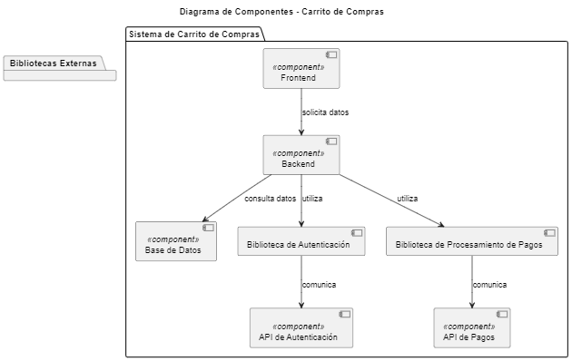

# Diagrama de Componentes del Carrito de Compras

## ¿Qué es un Diagrama de Componentes?

Un **Diagrama de Componentes** es un tipo de diagrama UML que describe los componentes físicos de un sistema, como archivos, bibliotecas y sus dependencias. Este diagrama es útil para visualizar la arquitectura del sistema y cómo los diferentes componentes interactúan entre sí.

## Elementos del Diagrama de Componentes

- **Componentes**: Representan las partes físicas del sistema. En este caso, tenemos:
  - **Frontend**: El componente de interfaz de usuario que interactúa con el cliente.
  - **Backend**: El componente que maneja la lógica de negocio y la comunicación con la base de datos.
  - **Base de Datos**: El componente que almacena la información de usuarios, productos y órdenes.

- **Bibliotecas Externas**: Representan bibliotecas utilizadas por el backend para realizar funciones específicas.
  - **Biblioteca de Autenticación**: Maneja el proceso de autenticación de usuarios.
  - **Biblioteca de Procesamiento de Pagos**: Maneja el procesamiento de transacciones de pago.
  - **API de Autenticación**: Proporciona servicios de autenticación a través de la red.
  - **API de Pagos**: Proporciona servicios de procesamiento de pagos a través de la red.

## Relaciones entre Componentes

- **Frontend** solicita datos al **Backend**.
- **Backend** consulta datos de la **Base de Datos**.
- **Backend** utiliza la **Biblioteca de Autenticación** y la **Biblioteca de Procesamiento de Pagos**.
- **Biblioteca de Autenticación** se comunica con la **API de Autenticación**.
- **Biblioteca de Procesamiento de Pagos** se comunica con la **API de Pagos**.

## Propósito del Diagrama de Componentes

El Diagrama de Componentes es útil para:

1. **Visualizar la Arquitectura del Sistema**: Proporciona una representación clara de cómo se organizan los diferentes componentes y cómo se relacionan entre sí.
2. **Identificar Dependencias**: Ayuda a entender las dependencias entre componentes y bibliotecas externas, lo que es crucial para la gestión de cambios y la resolución de problemas.
3. **Facilitar el Análisis de Implementación**: Permite a los desarrolladores identificar qué componentes deben ser implementados o modificados en función de los requisitos del sistema.

Este diagrama de componentes ofrece una visión estructurada de los elementos físicos del sistema de carrito de compras y cómo interactúan entre sí.


## Codigo del diagrama
```planuml
@startuml
title Diagrama de Componentes - Carrito de Compras

package "Sistema de Carrito de Compras" {
    [Frontend] <<component>> 
    [Backend] <<component>> 
    [Base de Datos] <<component>> 

    [Frontend] --> [Backend] : solicita datos
    [Backend] --> [Base de Datos] : consulta datos

    [Backend] --> [Biblioteca de Autenticación] <<component>> : utiliza
    [Backend] --> [Biblioteca de Procesamiento de Pagos] <<component>> : utiliza

    [Biblioteca de Autenticación] --> [API de Autenticación] : comunica
    [Biblioteca de Procesamiento de Pagos] --> [API de Pagos] : comunica
}

package "Bibliotecas Externas" {
    [API de Autenticación] <<component>>
    [API de Pagos] <<component>>
}

@enduml
```

## Resultado
