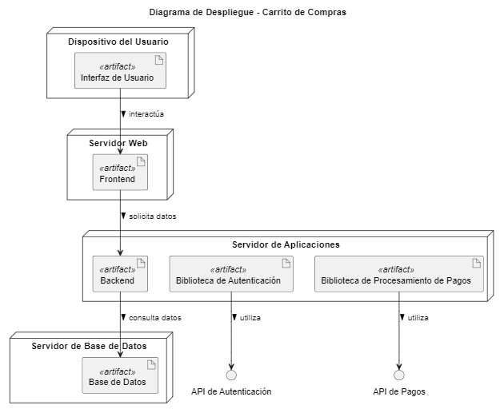

# Diagrama de Despliegue del Carrito de Compras

## ¿Qué es un Diagrama de Despliegue?

Un **Diagrama de Despliegue** es un tipo de diagrama UML que modela la distribución física de los nodos (servidores, dispositivos) y los artefactos que se ejecutan en ellos. Este diagrama es esencial para entender cómo se despliega el sistema en un entorno físico y cómo se comunican los diferentes componentes.

## Elementos del Diagrama de Despliegue

- **Nodos**: Representan los dispositivos o servidores físicos donde se despliegan los artefactos. En este caso, tenemos:
  - **Servidor Web**: Donde se despliega el componente de **Frontend** que maneja la interfaz de usuario.
  - **Servidor de Aplicaciones**: Donde se despliega el **Backend**, junto con las bibliotecas de **Autenticación** y **Procesamiento de Pagos**.
  - **Servidor de Base de Datos**: Donde se almacena la **Base de Datos** que maneja los datos del sistema.
  - **Dispositivo del Usuario**: Representa los dispositivos desde donde los usuarios interactúan con el sistema.

- **Artefactos**: Representan los componentes del sistema que se ejecutan en los nodos.
  - **Interfaz de Usuario**: El componente que los usuarios utilizan para interactuar con el sistema.
  - **Frontend**: Maneja la presentación y la lógica de la interfaz de usuario.
  - **Backend**: Maneja la lógica de negocio y la comunicación con la base de datos.
  - **Base de Datos**: Almacena la información relevante del sistema.

## Relaciones entre Nodos y Artefactos

- **Interfaz de Usuario** interactúa con el **Frontend** en el **Servidor Web**.
- **Frontend** solicita datos al **Backend** en el **Servidor de Aplicaciones**.
- **Backend** consulta datos de la **Base de Datos** en el **Servidor de Base de Datos**.
- **Biblioteca de Autenticación** y **Biblioteca de Procesamiento de Pagos** utilizan sus respectivas APIs.

## Propósito del Diagrama de Despliegue

El Diagrama de Despliegue es útil para:

1. **Visualizar la Infraestructura Física del Sistema**: Proporciona una representación clara de cómo se despliegan los componentes del sistema en diferentes nodos.
2. **Identificar la Comunicación entre Componentes**: Muestra cómo interactúan los diferentes artefactos entre sí, lo que ayuda a entender la dinámica del sistema.
3. **Facilitar la Gestión del Entorno de Producción**: Permite a los administradores de sistemas planificar y gestionar el entorno de despliegue del software de manera más efectiva.

Este diagrama de despliegue ofrece una visión estructurada de la distribución física de los nodos y los artefactos en un sistema de carrito de compras.


## Codigo del diagrama
```planuml
@startuml
title Diagrama de Despliegue - Carrito de Compras

node "Servidor Web" {
    artifact "Frontend" <<artifact>> 
}

node "Servidor de Aplicaciones" {
    artifact "Backend" <<artifact>> 
    artifact "Biblioteca de Autenticación" <<artifact>> 
    artifact "Biblioteca de Procesamiento de Pagos" <<artifact>> 
}

node "Servidor de Base de Datos" {
    artifact "Base de Datos" <<artifact>> 
}

node "Dispositivo del Usuario" {
    artifact "Interfaz de Usuario" <<artifact>> 
}

"Interfaz de Usuario" --> "Frontend" : interactúa >
"Frontend" --> "Backend" : solicita datos >
"Backend" --> "Base de Datos" : consulta datos >

"Biblioteca de Autenticación" --> "API de Autenticación" : utiliza >
"Biblioteca de Procesamiento de Pagos" --> "API de Pagos" : utiliza >

@enduml
```

## Resultado
