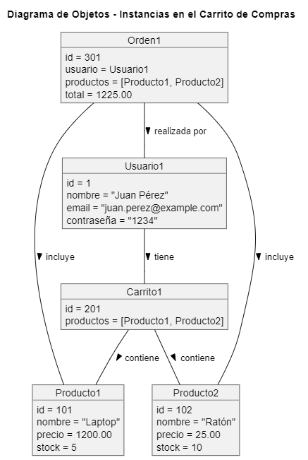

# Diagrama de Objetos del Carrito de Compras

## ¿Qué es un Diagrama de Objetos?

Un **Diagrama de Objetos** es un tipo de diagrama UML que representa instancias específicas de clases en un momento dado. Este diagrama muestra cómo los objetos interactúan entre sí y sus estados en un punto específico del tiempo.

## Elementos del Diagrama de Objetos

- **Instancias de Objetos**: Representan entidades concretas en el sistema. En este caso, tenemos:
  - **Usuario1**: Instancia de un usuario.
    - `id`: 1
    - `nombre`: "Juan Pérez"
    - `email`: "juan.perez@example.com"
    - `contraseña`: "1234"

  - **Producto1**: Instancia de un producto específico (Laptop).
    - `id`: 101
    - `nombre`: "Laptop"
    - `precio`: 1200.00
    - `stock`: 5

  - **Producto2**: Instancia de otro producto específico (Ratón).
    - `id`: 102
    - `nombre`: "Ratón"
    - `precio`: 25.00
    - `stock`: 10

  - **Carrito1**: Instancia de un carrito de compras.
    - `id`: 201
    - `productos`: Contiene a Producto1 y Producto2.

  - **Orden1**: Instancia de una orden de compra.
    - `id`: 301
    - `usuario`: Usuario1
    - `productos`: Incluye Producto1 y Producto2.
    - `total`: 1225.00

## Relaciones entre Objetos

- **Usuario1** tiene un **Carrito1**.
- **Carrito1** contiene **Producto1** y **Producto2**.
- **Orden1** es realizada por **Usuario1**.
- **Orden1** incluye **Producto1** y **Producto2**.

## Propósito del Diagrama de Objetos

El Diagrama de Objetos es útil para:

1. **Visualizar Instancias Concretas**: Muestra cómo las instancias de las clases están organizadas en un momento específico, lo que ayuda a entender la estructura del sistema en situaciones concretas.
2. **Facilitar el Análisis de Comportamientos**: Permite a los desarrolladores analizar cómo las instancias interactúan entre sí en un contexto particular.
3. **Ayudar en la Verificación de Implementación**: Sirve como una herramienta para comprobar si las instancias de los objetos y sus relaciones están implementadas correctamente en el código.

Este diagrama de objetos ofrece una representación clara de cómo las instancias del sistema de carrito de compras interactúan en un momento específico.

## Codigo del diagrama
```planuml
@startuml
title Diagrama de Objetos - Instancias en el Carrito de Compras

object Usuario1 {
    id = 1
    nombre = "Juan Pérez"
    email = "juan.perez@example.com"
    contraseña = "1234"
}

object Producto1 {
    id = 101
    nombre = "Laptop"
    precio = 1200.00
    stock = 5
}

object Producto2 {
    id = 102
    nombre = "Ratón"
    precio = 25.00
    stock = 10
}

object Carrito1 {
    id = 201
    productos = [Producto1, Producto2]
}

object Orden1 {
    id = 301
    usuario = Usuario1
    productos = [Producto1, Producto2]
    total = 1225.00
}

Usuario1 -- Carrito1 : tiene >
Carrito1 -- Producto1 : contiene >
Carrito1 -- Producto2 : contiene >
Orden1 -- Usuario1 : realizada por >
Orden1 -- Producto1 : incluye >
Orden1 -- Producto2 : incluye >

@enduml
```

## Resultado
