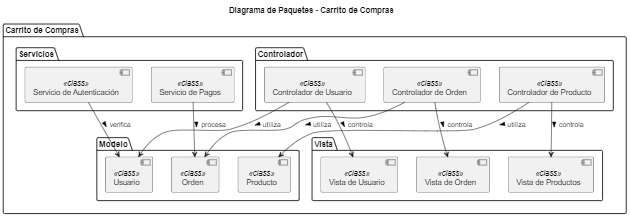

# Diagrama de Paquetes del Carrito de Compras

## ¿Qué es un Diagrama de Paquetes?

Un **Diagrama de Paquetes** es un tipo de diagrama UML que organiza y agrupa elementos del sistema en paquetes, mostrando sus relaciones. Este diagrama es útil para estructurar el sistema y entender cómo se organizan los diferentes componentes.

## Elementos del Diagrama de Paquetes

- **Paquetes**: Agrupan las clases y componentes del sistema. En este caso, tenemos los siguientes paquetes:
  - **Carrito de Compras**: Paquete principal que contiene todos los elementos del sistema.
    - **Modelo**: Contiene las clases que representan los datos del sistema.
      - **Producto**: Clase que representa un producto en el carrito de compras.
      - **Usuario**: Clase que representa a un usuario del sistema.
      - **Orden**: Clase que representa una orden de compra.

    - **Controlador**: Contiene las clases que manejan la lógica de negocio y controlan las interacciones entre la vista y el modelo.
      - **Controlador de Producto**: Maneja las operaciones relacionadas con productos.
      - **Controlador de Usuario**: Maneja las operaciones relacionadas con usuarios.
      - **Controlador de Orden**: Maneja las operaciones relacionadas con órdenes.

    - **Vista**: Contiene las clases que representan la interfaz de usuario.
      - **Vista de Productos**: Interfaz para mostrar productos al usuario.
      - **Vista de Usuario**: Interfaz para gestionar la información del usuario.
      - **Vista de Orden**: Interfaz para mostrar las órdenes al usuario.

    - **Servicios**: Contiene las clases que ofrecen funcionalidades adicionales.
      - **Servicio de Autenticación**: Maneja la autenticación de usuarios.
      - **Servicio de Pagos**: Maneja el procesamiento de pagos.

## Relaciones entre Paquetes

- **Controladores**: Cada controlador se conecta a su respectiva vista para controlar la interacción.
  - **Controlador de Producto** controla la **Vista de Productos**.
  - **Controlador de Usuario** controla la **Vista de Usuario**.
  - **Controlador de Orden** controla la **Vista de Orden**.

- **Modelo**: Cada controlador utiliza la clase correspondiente en el modelo.
  - **Controlador de Producto** utiliza la clase **Producto**.
  - **Controlador de Usuario** utiliza la clase **Usuario**.
  - **Controlador de Orden** utiliza la clase **Orden**.

- **Servicios**: Los servicios interactúan con las clases del modelo.
  - **Servicio de Autenticación** verifica los usuarios.
  - **Servicio de Pagos** procesa las órdenes.

## Propósito del Diagrama de Paquetes

El Diagrama de Paquetes es útil para:

1. **Organizar Componentes**: Ayuda a estructurar el sistema agrupando elementos relacionados en paquetes, lo que facilita la comprensión del sistema.
2. **Visualizar Dependencias**: Muestra las relaciones entre diferentes partes del sistema, ayudando a identificar dependencias y cohesión.
3. **Facilitar la Gestión de Proyectos**: Permite a los desarrolladores y arquitectos de software gestionar y planificar mejor el desarrollo y mantenimiento del sistema.

Este diagrama de paquetes ofrece una visión clara de cómo se organizan los elementos del sistema de carrito de compras y sus relaciones.


## Codigo del diagrama
```planuml
@startuml
title Diagrama de Paquetes - Carrito de Compras

package "Carrito de Compras" {
    package "Modelo" {
        [Producto] <<class>>
        [Usuario] <<class>>
        [Orden] <<class>>
    }

    package "Controlador" {
        [Controlador de Producto] <<class>>
        [Controlador de Usuario] <<class>>
        [Controlador de Orden] <<class>>
    }

    package "Vista" {
        [Vista de Productos] <<class>>
        [Vista de Usuario] <<class>>
        [Vista de Orden] <<class>>
    }

    package "Servicios" {
        [Servicio de Autenticación] <<class>>
        [Servicio de Pagos] <<class>>
    }
}

[Controlador de Producto] --> [Vista de Productos] : controla >
[Controlador de Usuario] --> [Vista de Usuario] : controla >
[Controlador de Orden] --> [Vista de Orden] : controla >

[Controlador de Producto] --> [Producto] : utiliza >
[Controlador de Usuario] --> [Usuario] : utiliza >
[Controlador de Orden] --> [Orden] : utiliza >

[Servicio de Autenticación] --> [Usuario] : verifica >
[Servicio de Pagos] --> [Orden] : procesa >

@enduml
```

## Resultado
