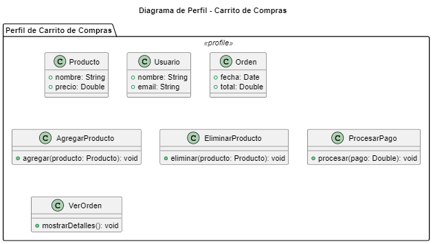

# Diagrama de Perfil del Carrito de Compras

## ¿Qué es un Diagrama de Perfil?

Un **Diagrama de Perfil** es un tipo de diagrama UML que extiende la semántica de UML mediante estereotipos y etiquetas personalizadas. Este tipo de diagrama permite personalizar y adaptar el modelo UML a un dominio específico, agregando información adicional que puede ser útil para entender mejor el sistema.

## Elementos del Diagrama de Perfil

- **Estereotipos**: Se utilizan para definir nuevas categorías o tipos dentro de UML.
  - **CarritoDeCompras**: Estereotipo que representa el conjunto de elementos relacionados con el carrito de compras.
    - **Producto**: Representa los productos que se pueden agregar al carrito.
      - Atributos: `nombre`, `precio`.
    - **Usuario**: Representa a los usuarios que interactúan con el carrito de compras.
      - Atributos: `nombre`, `email`.
    - **Orden**: Representa las órdenes realizadas por los usuarios.
      - Atributos: `fecha`, `total`.

  - **Operaciones**: Agrupa las funcionalidades que el sistema puede realizar.
    - **AgregarProducto**: Representa la operación de agregar un producto al carrito.
      - Método: `agregar(producto: Producto): void`.
    - **EliminarProducto**: Representa la operación de eliminar un producto del carrito.
      - Método: `eliminar(producto: Producto): void`.
    - **ProcesarPago**: Representa la operación de procesar un pago.
      - Método: `procesar(pago: Double): void`.
    - **VerOrden**: Representa la operación de visualizar una orden.
      - Método: `mostrarDetalles(): void`.

## Propósito del Diagrama de Perfil

El Diagrama de Perfil es útil para:

1. **Extender UML**: Permite personalizar y adaptar el lenguaje UML a las necesidades específicas de un dominio o contexto, enriqueciendo el modelo con estereotipos significativos.
2. **Mejorar la Comprensión**: Facilita la comprensión de elementos y operaciones específicas del sistema al usar etiquetas personalizadas que reflejan mejor la funcionalidad del sistema.
3. **Organizar Conceptos**: Ayuda a organizar conceptos complejos y proporciona una representación clara de las relaciones y tipos dentro del sistema.

Este diagrama de perfil ofrece una visión clara de cómo se pueden extender los elementos de UML para representar un sistema de carrito de compras de manera más específica y adaptada.


## Codigo del diagrama
```planuml
@startuml
title Diagrama de Perfil - Carrito de Compras

package "Perfil de Carrito de Compras" <<profile>> {
    class "Producto" <<<<CarritoDeCompras>>>> {
        + nombre: String
        + precio: Double
    }

    class "Usuario" <<<<CarritoDeCompras>>>> {
        + nombre: String
        + email: String
    }

    class "Orden" <<<<CarritoDeCompras>>>> {
        + fecha: Date
        + total: Double
    }

    class "AgregarProducto" <<<<Operaciones>>>> {
        + agregar(producto: Producto): void
    }

    class "EliminarProducto" <<<<Operaciones>>>> {
        + eliminar(producto: Producto): void
    }

    class "ProcesarPago" <<<<Operaciones>>>> {
        + procesar(pago: Double): void
    }

    class "VerOrden" <<<<Operaciones>>>> {
        + mostrarDetalles(): void
    }
}

@enduml
```

## Resultado
